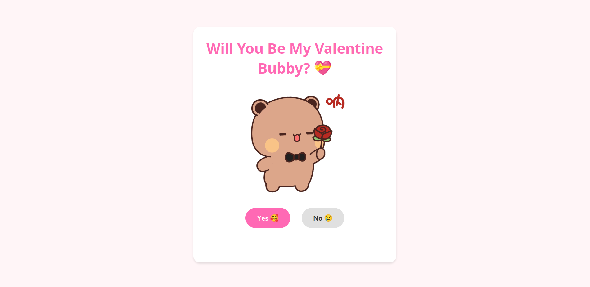

# Mr. Valentine 💝

The most adorable way to ask someone to be your Valentine! 🌹

## What is this? 🤔

This is a super cute web application that helps you pop the Valentine's question in the most irresistible way possible! Built with love (and Go) 💖, this app creates an interactive experience that makes saying "Yes" impossible to resist!



## Features ✨

- 🎯 Simple and adorable UI
- 🎨 Beautiful animations and GIFs
- 🎮 Interactive buttons with a twist
- 🌺 Flower animations
- 🤭 A touch of playful manipulation (the "No" button might be a bit shy!)

## Tech Stack 🛠️

- 🚀 Backend: Go (with Chi router)
- 💅 Frontend: HTML, CSS, TypeScript
- 🎨 UI: Pure CSS animations
- 🖼️ Assets: Cute GIFs and images
- 📦 Build Tools: TypeScript compiler, Make, Air (Go hot reload)

## Prerequisites for development 📋

- Go 1.23.6 or higher
- Node.js and npm (for TypeScript compilation)
- Air will be automatically installed via make commands

## Running Locally 🏃‍♂️

1. Clone this repository 📦
2. Choose your preferred way to run:

```bash
make install-tools  # Install all development tools (Air, TypeScript, etc.)
make all           # Clean, build frontend assets, and create binaries for Linux and Windows
make build         # Create binaries for Linux and Windows
make run           # Build frontend assets and run the app locally
make dev           # Run in development mode with hot-reloading (both TypeScript and Go)
```

> All binaries will be created in the `/bin` directory.
> TypeScript compiled files will be in `/ui/static/scripts/dist`.

The app will automatically open in your default browser at `http://localhost:14334` 🌐

## Development 🛠️

- Use `make dev` to start the development server with:
  - 🔄 Go hot-reloading via Air (automatically recompiles and restarts on Go file changes)
  - 📝 TypeScript watch mode (automatically recompiles on TypeScript file changes)
  - 🚀 All changes are reflected immediately without manual restart
- The TypeScript source files are located in `/ui/static/scripts`
- Frontend assets are automatically compiled before the server starts
- Air configuration is in `.air.toml`

## Contributing 💕

Feel free to contribute! Whether it's adding more cute features, improving the animations, or making the experience even more delightful - all contributions are welcome!

## License 📜

This project is licensed with love ❤️ - see the LICENSE file for details.

## A Note from the Developer 📝

Remember, love is in the code! 💻❤️ This project was created to spread joy and make Valentine's Day proposals a bit more tech-savvy and fun!

---

Made with 💝 and lots of `fmt.Println("love")`
